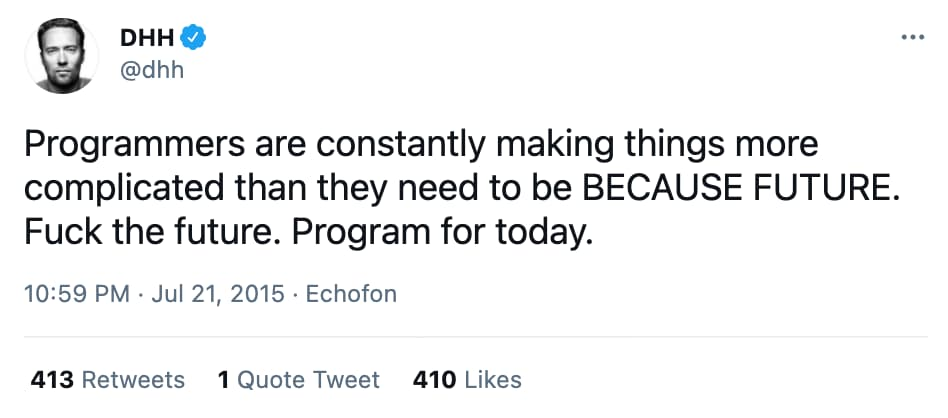
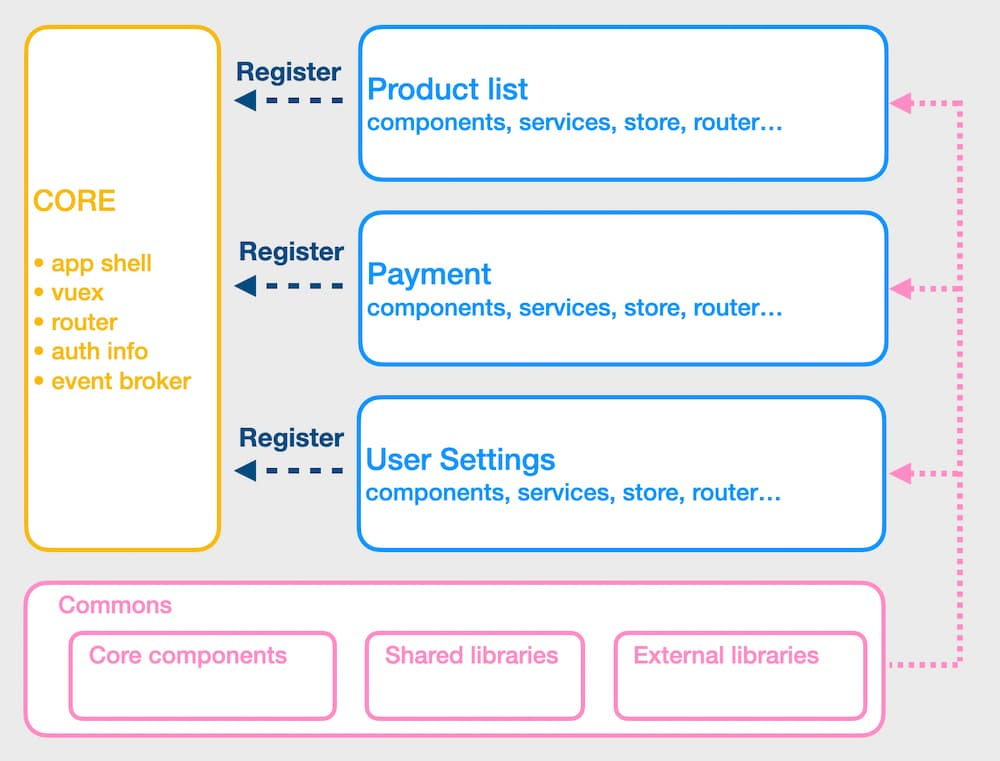

## How big?

For the last 3y I have been working on a large vue.js application. I've been working on both functionalities but also architectural parts.
If you're curious about the project, here are some numbers:
* +5k vue&js files / +650k lines of codes (a little bit bigger than the GitLab App)
* 10 years old. Vue.js landed in December 2016
* we have 2 repos: the app monolith + 1 monorepo (contains ~40 npm packages)
* it's a Single Page Application (SPA)

I don't want to play who got the bigger, as there's nothing shinny here. Our application is not big. It's too big.


## #1 Team communication

* Avoid Avoid *Hype Driven Development™️*. (i.e. rxjs)
adding a new dependencies should be discussed and approved (https://docs.gitlab.com/ee/development/code_review.html#approval-guidelines)
* Communicate and make things **consistents**. If your app is organised in 3 different feature teams you don't want to have 3 different way of doing one things. Communication is the key.
* lint your code. No one like comment like "you forgot a semicolon" on pull requests. Find a rule and follow it. Blindly. If you start to discuss it, you open a door for bikeshedding.
* reviewing code should be a team effort.

### Respect your elders

...

## #2 Common architectural stuffs

### "F*** the future. Program for today."

[](https://twitter.com/dhh/status/623598101127897088?lang=en)

We've made a lot of big technical decision based on FUTURE. Guess what? Years after this future never happen.
I don't have a crystal ball so I can't tell how the future will look like. If it's the same for you, don't take big decision based on deam and hopes. 

Program for today!

### Modularize your monolith

Find an architectural style that matches your style. This is ours:




We adopted a modularised approach for our app. In a nutshell, 1 module = 1 business part of the app. And it's also something that looks like a standalone vue application. We consider modules as self-contained which can potentially be exported. By the way, some are exported as a npm packages ([in a monorepo](/monorepo-pros-and-cons)).

Modules are not allowed to talk to each other... in theory. If 2 modules have to communicate, you can use the [CustomEvent API](https://developer.mozilla.org/en-US/docs/Web/API/CustomEvent/CustomEvent) from the browser and dispatch an event via the window object.

> 🙋‍♀️ How do you register modules?

With the vue-router. Module loosely corresponding to a single top-level URL root. With this trick, module are ["lazy loaded"](https://router.vuejs.org/guide/advanced/lazy-loading.html). So user don't load the entire app when application load.

```js
const ProductList = () => import('@company/product-list')
// or if the module is local
const ProductList = () => import('./path/to/product-list')


const router = new VueRouter({
  routes: [{ path: '/product-list', component: ProductList }]
})
```


### Dead code hunt

Adding new code is easy, deleting is hard. If someone open a PR and kill some dead code, give to the developer some public kudos. Encourage your colleagues to delete dead code!

### Dependencies management

be strict with your dependencies
* track size. Some libraries allow tree-shaking, use it! (i.e `import foo from 'lodash/foo'` instead `import { foo } from 'lodash'`)
* you probably don't need library for simple things

### Performances issues are rarely in the code

monitor perf
it's should be a process not a reaction

### `// TODO: refactor`

**TODOs are the graveyard of important but not urgent tasks.** In other words, if you can't complete the todo, in most of cases, no-one will. If you're not very proud about the code you wrote (no worries, it happens to the best of us), it's fine. But please don't pollute the code with a TODO.


## #3 Component Library

### Don't create your core components from scratch!


We started building our own component system ~2.5y ago. As you might guess, a lot of components we created, ended up being surprisingly complex. For some of them we managed to get them refactored. For other we had no choices than deprecating them. Today, we have ~30 deprecated components and some of them are used a hundred time.
Looking backward, we wasted so much time creating the components, writing the documentation, making the component accessible (a11y). We could have spend more time focusing on the business or the architectural part instead.

If you think that no library on the market is able to craft the perfect button with the perfect border radius and this is so important for you, you should have a closer look at Amazon.com ;)

### Put all core-components, icons, fonts and colors in one place

Even if you start from an existing component library, you might have to build your reusable components. For instance, I build application for schools and we created our own timetable component. It's stored in an external npm package where it can be reused.

At the end, when we have to build a new screen it's pretty much like doing lego. We provide a kind of bookshelf with already built component. Based on their need, developers pick what they need. Most of the time, writting CSS is not needed.

### Storybook is a great tool, use it!


Storybook is a great bridge between frontend team and UX team. We heavily rely on this tool and so far, we're very happy to use it.


## #4 Component state & Store (Vuex)

I won't be very talkative there as [I already explained why](/3-tips-scaling-vue-application#tip-3-be-kind-with-your-store-vuex), in my opinion, storing everything in the store is a bad idea.

To be short:
* because of it's nature, a vuex store make your app [harder to test (integration/unit)](/vue-js-testing-library#testing-the-store-with-vuex);
* scoped stores are hard to unregister. Unnecessary datas can be kept in memory and if the state is not reinitialized correctly it can mess up the UI is the user is going back on an already visited screen;
* if you have +10 mutation when page load, time travel (devtools) become irrelevant;
* as the store grow up, state/mutation/actions are very hard to remove.

I mentionned earlier the module approach we have. Our modules are like a small vue-cli app with a few pages only. Controlling the components's store with Vuex doesn't make a lot of sense.

Don't get me wrong. I'm not saying you shouldn't use Vuex. But, I don't think it should be used to store everything!

## #5 Testing

Test your app! Every Friday I see on twitter the same stupid tweets saying "it's friday, don't deploy to production". 

* unit test business part or tricky functions
* integration test for the rest!
* keep code coverage for dashboard-oriented-manager. Consider uncovered code untested and covered code potentially tested.
* it must be automated (1 build / merge request)


## Closing

Your app will never be perfect, and it's fine.
Keep it simple.