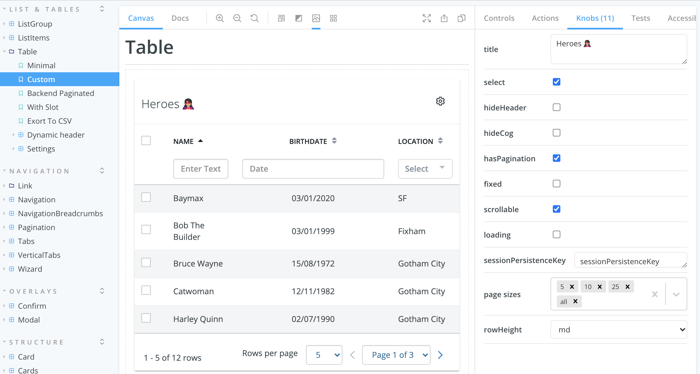

## How big?

For the last 3y I have been working on a large vue.js application. I've been working on both functionnalities but also architectural parts.
If you're curious about the project, here are some numbers:
* +5k vue&js files / +650k lines of codes
* 10 years old. Vue.js landed in December 2016
* we have 2 repos: the app monolith + 1 monorepo (contains ~40 npm packages)

For comparison, the codebase is a little bit bigger than GitLab.

## #1 Team communication

* Avoid Avoid *Hype Driven Development™️*. (i.e. rxjs)
adding a new dependencies should be discussed and approved (https://docs.gitlab.com/ee/development/code_review.html#approval-guidelines)
* Communicate and make things **consistents**. If your app is organised in 3 different feature teams you don't want to have 3 different way of doing one things. Communication is the key.
* lint your code. No one like comment like "you forgot a semicolon" on pull requests. Find a rule and follow it. Blindly. If you start to discuss it, you open a door for bikeshedding.
* don't blame the elders.

## #2 Common architectural stuffs

* find an architectural style that matches your style (i.e. smart&dumb component)
* try to modularise your app. 1 module = 1 business part of the app. Consider module as a silo.
* [program for today, don't overthink about future](https://twitter.com/dhh/status/623598101127897088?lang=en)
* kill all the global variables, both js and css. Might be OK for a hello-world project. It's defenitelly not for an enterprise application,
* Discuss and document tech decisions.
* be strict with your dependencies
  * track size. Some libraries allow tree-shaking, use it! (i.e `import foo from 'lodash/foo'` instead `import { foo } from 'lodash'`)
  * you probably don't need library for simple things
* adding new code is easy, deleting is hard. If someone open a PR and kill some dead code, give to the developer some public kudos. Encourage dead code hunts.

## #3 Component Library

### Don't create your core components from scratch!
We started building our own component system ~2.5y ago. As you might guess, a lot of components we created, ended up being surprisingly complex. For some of them we managed to refactor them. For other we had no choices than deprecating them. When I'm writing these lines we have ~30 deprecated components and some of them are used a hundred time.
Between the development, writing docs and making it a11y; we wasted too many time crafting this library. I wish I anticipated this before! We could have focus on the business part instead.

### have a centralised design system

In one place put all the core components (i.e. buttons, checkboxes), icons, fonts and colors.

### Storybook is a great tool, use it

slots are great. Use it!

## Component state & Store (Vuex)

* [Don’t overuse your Vuex store](https://www.maxpou.fr/3-tips-scaling-vue-application#tip-3-be-kind-with-your-store-vuex)
* store make your app harder to test
* scoped stores are hard to unregister. Unecessary information can be kept in memory

## Testing 

* Testing: test your app!
  * unit test business part or tricky functions
  * integration test for the rest!
  * keep code coverage for dashboard-oriented-manager. Consider uncovered code untested and covered code potentially tested.
  * it must be automated (1 build / merge request)

## Closing

Your app will never be perfect and it's fine.
Keep it simple.